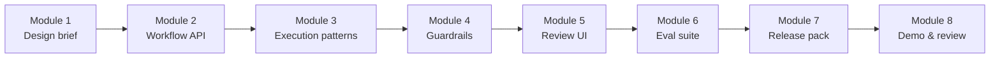

# Governed AI Feature Delivery

**Marsh · Hands-on course**

This repository supports an eight-module workshop on building and shipping AI features in regulated environments. You work through a single end-to-end scenario—a **document intake assistant** that extracts structured data from submitted text—and add governance controls layer by layer: design decisions, backend workflow gates, security guardrails, reviewable UI, evaluation suites, and release readiness.

The course is practical, not theoretical. You implement real NestJS and React code, produce artefacts auditors and release managers can use, and finish with an integrated stack you can demo and defend.

---

## Who this is for

Engineers, architects, and product owners who need to move AI features from prototype to production without treating governance as an afterthought. You should be comfortable with TypeScript and basic web APIs. Prior LLM experience helps but is not required—the labs focus on **control points, traceability, and release discipline** rather than model tuning.

---

## What you will learn

By the end of the course you will be able to:

- Map AI outcomes (`accepted`, `needs_review`, `denied`) to explicit control points in a pipeline
- Implement a governed NestJS workflow with pre-call, post-call, and routing gates
- Choose between workflow, tool-augmented, and agent-style execution—and document what you defer
- Layer security guardrails (hostile input screening, policy checks, deny paths) with trace evidence
- Build frontend panels that make AI results safe to review without leaking sensitive content
- Author a golden eval dataset and produce a release gate report with a written recommendation
- Define kill-switch behaviour, gate ownership, and a release-readiness pack for regulated rollout
- Integrate and demo the full stack with defensible provenance (`promptVersion`, `modelIdentifier`, trace IDs)

---

## The scenario

Throughout the labs you govern a **document extraction** feature:

- Users submit document text (or use built-in samples).
- The backend runs a structured workflow: validate → call model (mock or OpenAI) → validate output → route by confidence.
- The API returns one of three statuses: **`accepted`**, **`needs_review`**, or **`denied`**.
- Every decision is traceable in logs and reflected in the UI.

Sample inputs in the demo app illustrate the three paths (e.g. a passing invoice, low-confidence failure, policy-blocked content). Your job is to make those paths **intentional, observable, and release-ready**.

---

## Course modules

| Module | Focus | Format | Lab guide |
| ------ | ----- | ------ | --------- |
| **1** | Governed AI design decisions | Think–pair–share (no code) | [module-01-ai-feature-delivery/README.md](module-01-ai-feature-delivery/README.md) |
| **2** | Structured workflow endpoint | Build (NestJS) | [module-02-backend-workflow-patterns/README.md](module-02-backend-workflow-patterns/README.md) |
| **3** | Workflow vs agent execution patterns | Build + design brief | [module-03-workflow-vs-agent-design/README.md](module-03-workflow-vs-agent-design/README.md) |
| **4** | Security and guardrails | Build + governance | [module-04-security-and-guardrails/README.md](module-04-security-and-guardrails/README.md) |
| **5** | Reviewable AI UX | Build (React) | [module-05-frontend-ai-ux-patterns/README.md](module-05-frontend-ai-ux-patterns/README.md) |
| **6** | Evaluation and quality assurance | Dataset + release gate | [module-06-evaluation-and-quality-assurance/README.md](module-06-evaluation-and-quality-assurance/README.md) |
| **7** | Deployment and governance | Kill switch + readiness pack | [module-07-deployment-and-governance/README.md](module-07-deployment-and-governance/README.md) |
| **8** | Final build and review | Integration demo + adoption | [module-08-final-build-and-review/README.md](module-08-final-build-and-review/README.md) |

**Typical session length:** ~45 minutes per module (Module 1 and 8 may run 40–60 minutes). Module 1 produces a design brief you carry into Module 2.

---

## Repository layout

```
marsh_repo/
├── readme.md                          ← this file
├── demo-app/                          ← reference full-stack app (instructor solution)
│   ├── backend/                       ← NestJS API, evals, release gate
│   └── frontend/                      ← Vite + React UI
├── module-01-ai-feature-delivery/     ← Lab 1 (design only)
├── module-02-backend-workflow-patterns/
│   └── demo-app-starter/              ← Module 2 starter backend
├── module-03-workflow-vs-agent-design/
│   └── module_03_starter_app/         ← Module 3 starter (backend)
├── module-04-security-and-guardrails/
│   └── module_04_starter_app/
├── module-05-frontend-ai-ux-patterns/
│   └── module_05_starter_app/         ← backend + frontend
├── module-06-evaluation-and-quality-assurance/
│   └── module_06_starter_app/
├── module-07-deployment-and-governance/
│   └── module_07_starter_app/
└── module-08-final-build-and-review/  ← integration checklist (no new starter)
```

- **`demo-app/`** — Complete solution after Modules 2–7. Use it to explore behaviour before the labs or as a reference when stuck.
- **`module_XX_starter_app/`** — Starting point for that module’s exercises (where applicable).
- Continue from your own working tree when possible; starters are for fresh starts or catch-up.

---

## Prerequisites

- **Node.js** 20 or newer
- **npm**
- Two terminal windows for full-stack work (backend + frontend)
- Optional: **OpenAI API key** if you switch from mock mode to live model calls (not required for most lab work)

---

## Quick start (full demo app)

From the repo root:

**Backend** (default: mock LLM, port 3000):

```bash
cd demo-app/backend
cp .env-example .env
npm install
npm run dev
```

**Frontend** (port 5173):

```bash
cd demo-app/frontend
cp .env.example .env
npm install
npm run dev
```

Open the URL Vite prints (typically http://localhost:5173). The UI talks to the API at `http://localhost:3000` unless you change `VITE_API_BASE_URL`.

Health check:

```bash
curl http://localhost:3000/documents/health
```

Detailed setup, runtime profiles, extraction contract, evals, and operations (kill switch, rollback): see [demo-app/README.md](demo-app/README.md) and [demo-app/backend/README.md](demo-app/backend/README.md).

---

## Technology stack

| Layer | Stack |
| ----- | ----- |
| API | NestJS, TypeScript |
| UI | Vite, React, TypeScript |
| AI integration | Gateway abstraction; `mock` or `openai` via env |
| Quality | Vitest, document-extraction eval runner |
| Governance | Versioned prompts, trace events, confidence routing, feature flags / kill switch |

Runtime profiles (`dev`, `stage`, `prod`) control defaults for LLM mode, confidence thresholds, and optional Mastra runtime alignment—see backend README for overrides.

---

## How the labs connect



1. **Module 1** — Decide outcome-to-control mapping and audit contract (no code).
2. **Modules 2–4** — Implement and harden the backend pipeline.
3. **Module 5** — Surface outcomes safely in the UI.
4. **Modules 6–7** — Prove behaviour with evals and document release readiness.
5. **Module 8** — Run the integrated demo and plan team adoption.

Artefacts you produce along the way (design brief, trace contract, eval reports, `release-readiness-pack.md`) are inputs to later modules—keep them in your working branch or notes.

---

## API contract (summary)

`POST /documents/extract`

Request body includes document `text`, optional `source`, and optional `traceId`. Responses include `status`, `traceId`, `promptVersion`, `modelIdentifier`, and either structured `data` (accepted) or a `reason` (needs review / denied).

Full request/response shapes and sentinel test inputs (`FAIL:`, `POLICY:`, etc.) are documented in [demo-app/backend/README.md](demo-app/backend/README.md).

---

1. Read the lab README for your current module before writing code.
2. Prefer continuing your own backend/frontend from the previous module; use a module starter only if you need a clean baseline.
3. Run `npm test` in the backend when you change workflow or validation logic.
4. Bring your Module 1 design brief and Module 6–7 artefacts into Module 8—the integration checklist assumes they exist.

---

## Support and attribution

For environment-specific issues (proxy, API keys, CORS), check `.env-example` / `.env.example` files in the relevant `backend/` or `frontend/` folder first.
